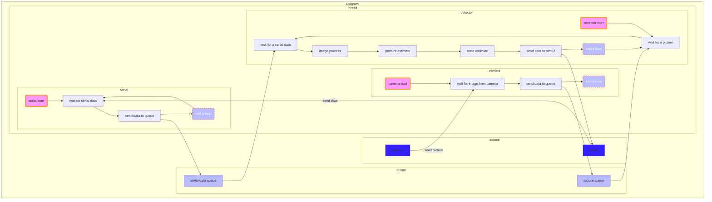

# AIM_HUST-2022
华中科技大学狼牙战队2022赛季步兵自瞄程序。

## 简介

1. 硬件配置

硬件上我们使用大恒相机+5mm焦距镜头,miniPC使用的是NVIDIA Jetson TX2

2. 功能

- 自瞄
- 反陀螺
- 能量机关

3. 部署需要调节的参数有

- 传统视觉相机参数，如曝光，增益等
- 大恒相机ID
- 相机内参数
- 相机镜头到枪管的平移向量
- USE转串口设备名字
- 线程延时
- 传统视觉识别参数，如二值化阈值,灯条装甲板几何约束参数
- 相机到枪管的旋转角度yaw_bias和pitch_bias(相机安装不可能完全与枪管无旋转)
- 发射延迟
- 卡尔曼滤波参数，如测量噪声，过程噪声
- 强跟踪滤波器参数
- 卡方检验数

## 环境配置

- Ubuntu 18.04 LTS
- gcc 7.5.0
- OpenCV 4.5.1
- Eigen非模板类
- Ceres
- Sophus
- LCM
- Glog
- Jsoncpp

## 文件结构

```txt
.
├── auto_start.sh    //自启动脚本    
├── CMakeLists.txt                  
├── README.md                       
└── src                              
    ├── armor_detector                 // 自瞄   
    │   ├── CMakeLists.txt                       
    │   ├── include                              
    │   │   ├── ArmorFinder.h                    
    │   │   ├── DetectAccelerator.h               
    │   │   ├── Detector.h                        
    │   │   ├── EnemyType.h                        
    │   │   ├── LightBarFinder.h                   
    │   │   ├── NumberClassifier.h
    │   │   └── TargetBumper.h
    │   └── src
    │       ├── ArmorFinder.cpp         // 灯条匹配装甲板
    │       ├── DetectAccelerator.cpp   // ROI提取
    │       ├── Detector.cpp            // 自瞄子线程
    │       ├── LightBarFinder.cpp      // 预处理 & 筛选灯条
    │       ├── NumberClassifier.cpp    // HOG + SVM 数字分类
    │       └── TargetBumper.cpp        // 优先级判断
    ├── AutoAim.cpp                     // 主程序，生成子线程
    ├── AutoAim.h
    ├── buff                            // 能量机关
    │   ├── CMakeLists.txt
    │   ├── include
    │   │   ├── AdaptiveEKF.hpp
    │   │   ├── buffAngleKalman.h
    │   │   ├── buffArmorNode.h
    │   │   ├── buffClassifier.h
    │   │   ├── buffCompensation.h
    │   │   ├── buffCurver.h
    │   │   ├── buffDetector.h
    │   │   ├── buffEKF.h
    │   │   ├── buffKalman.h
    │   │   └── buffPredictor.h
    │   └── src
    │       ├── buffAngleKalman.cpp
    │       ├── buffClassifier.cpp          // 能量机关SVM分类器
    │       ├── buffCompensation.cpp        // 能量机关补偿计算
    │       ├── buffCurver.cpp              // 正弦曲线拟合
    │       ├── buffDetector.cpp            // 能量机关识别器
    │       ├── buffEKF.cpp                 // 能量机关EKF角度滤波，已弃用
    │       ├── buffKalman.cpp              // 能量机关KF角度滤波，已弃用
    │       └── buffPredictor.cpp           // 能量机关预测器
    ├── driver
    │   ├── CMakeLists.txt
    │   ├── include
    │   │   ├── DxImageProc.h
    │   │   ├── GxCamera.h
    │   │   ├── GxIAPI.h
    │   │   ├── SerialPort.h
    │   │   └── VideoCapture.h
    │   └── src
    │       ├── GxCamera.cpp                // 大恒相机软件驱动
    │       ├── SerialPort.cpp              // 串口通信线程
    │       └── VideoCapture.cpp            // 采集图像线程
    ├── lcm                  // LCM通信模块，用以发送信息给自己电脑debug使用，需要配合QT小程序使用
    │   ├── CMakeLists.txt
    │   ├── example_t.lcm
    │   ├── exlcm
    │   │   └── example_t.hpp
    │   ├── info.hpp
    │   ├── lcm_module.cpp
    │   └── lcm_module.h
    ├── pose_estimate        // 位姿估计
    │   ├── CMakeLists.txt
    │   ├── include
    │   │   ├── AdaptiveEKF.hpp
    │   │   ├── CTModel.h
    │   │   ├── ExtendedKalman.hpp
    │   │   ├── NormalEKF.h
    │   │   ├── NormalKalman.h
    │   │   ├── PitchYawFilter.h
    │   │   ├── PoseSolver.h
    │   │   ├── Predictor.h
    │   │   ├── SecondFilter.h
    │   │   └── STF.hpp                        //强跟踪滤波器有关文件
    │   └── src
    │       ├── CTModel.cpp                   // CT运动模型估计小陀螺的旋转，已弃用
    │       ├── NormalEKF.cpp                 // EKF滤波进行状态估计(参考上交)
    │       ├── NormalKalman.cpp              // CV模型进行状态估计，已被EKF代替
    │       ├── PitchYawFilter.cpp
    │       ├── PoseSolver.cpp
    │       ├── Predictor.cpp
    │       └── SecondFilter.cpp               // 卡尔曼滤波进行低通滤波
    └── utils
        ├── CMakeLists.txt
        ├── destroy             // 部分以后可能有参考价值的弃用代码
        │   ├── AdaptiveEKF.hpp
        │   ├── CAModel.cpp                     // CA运动模型
        │   ├── CAModel.h
        │   ├── CTModel.cpp                     // CT旋转估计模型
        │   ├── CTModel.h
        │   ├── README.md
        │   ├── SingerExtendedFilter.cpp        // Singer模型(EKF)
        │   ├── SingerExtendedFilter.h
        │   ├── SingerFilter.cpp                // Singer模型(KF)
        │   └── SingerFilter.h
        ├── include
        │   ├── Config.h
        │   ├── LockFreeQueue.hpp                // 无锁循环队列
        │   ├── Log.h
        │   ├── Params.h
        │   └── Timer.h
        ├── src 
        │   ├── Config.cpp                       // 配置文件读取
        │   ├── Log.cpp                          // 日志
        │   ├── Params.cpp                       // 参数定义
        │   └── Timer.cpp                        // 计时器，用来计算帧率; 或作为计数器，用来分频
        └── tools
            ├── buff_model.xml                   // 能量机关SVM模型
            ├── init.json                        // 配置文件
            └── svm_numbers.xml                  // 数字分类SVM模型
```
## 代码规范

| 规范      | 含义 |示例|
| ----------- | ----------- |-----------|
| 首字母大写，单词间大写区分      | 文件名,类名    | ArmorBlob: 即ArmorBlob类|
| 首字母小写，单词间大写区分   | 函数名        |initHog: 即Hog初始化函数|
| 首字母小写，单词以下划线区分   | 变量        |lut_table: LUT表格|
| 全小写，名词为变量，动词为函数   | 一些简单变量以及含义明确的函数        |Kalman类的predict: 卡尔曼滤波预测过程|

## 设计模式

生产者消费者模式

## 如何使用？

1. 
```
    sudo vim /etc/rc.local
```

2. 将以下代码加在"exit 0"之前,然后保存退出编辑

```
    sh you_dir/auto_start.sh
```

3. 
```
    sudo chmod +x /etc/rc.local
```

## 算法演示

见video文件夹

## 程序框图

tips: 需使用mermaid观看流程图


## 优化方向

1. 更鲁棒的识别性能

如何应对复杂的灯光一直是赛场上令每个RMer都头疼的问题，当前识别主要有两个思路，一个是传统视觉方向，一个是深度学习方向。传统视觉方向对环境光照依赖较高，但逻辑更为简单，且很多误分类可以通过简单设置约束参数完成。深度学习则对灯光更为鲁棒,但是一旦识别出现问题则很难纠正。

传统视觉做鲁棒的主要思路是:更加细致的调参以及数字分类模型的完善，细致的调参可以保证在数字分类之前留下更少的候选装甲板，而数字分类模型则应该能适应灯光的变化，降低分类的错误率。

2. 更加好的控制

我们今年忽略的一个很大的问题就是将卡尔曼滤波放到上位机上跑，并且将视觉组和嵌软组的工作割裂开来。导致视觉组地工作既不弄清数据来源，做好数据处理，也不关心数据去向，不知道发送给串口地数据如何作用于云台控制，导致最终自瞄系统并没有发挥出其最佳的性能。

3. 更丝滑的状态切换逻辑

我们当前的反小陀螺在实战中难以派上用场,因为在普通状态和反陀螺状态切换过程十分地“笨拙”,无论是进入还是退出反陀螺状态。下赛季考虑做一个不区分敌方处于什么状态的滤波器(或者是更灵敏切换状态地逻辑)
