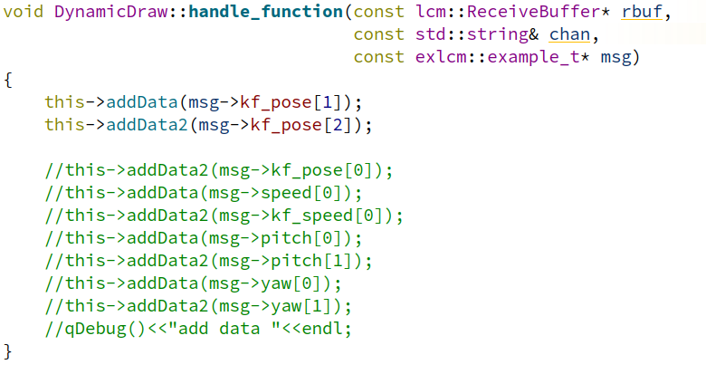

# 如何使用？

1. 安装LCM通信库(TX2上，如果自己电脑也要编译通过的话，也要安装)，库为lcm-1.4.0文件夹
   [LCM通信库官网地址](https://lcm-proj.github.io/)

2. 需要在程序CMake链接lcm_module静态库，包含头文件路径

3. 程序里#include"lcm_module.h"

4. 定义LcmDebug()类，如LcmDebug lcm;

5. lcm->sendData()  这个函数用来发送数据，里面每个参数独立，不需要发送的参数可以随便定义一个变量放进去

    这个函数一般用来发送原数据和滤波数据，来查看滤波效果

6. 用Qt打开plot文件夹，只需要修改如图函数，将需要显示的内容放进addData()函数和addData2()函数内即可

    

7. plot2文件夹的内容和plot1基本一致，不过包含时间戳，可以绘制出一个时间实际位置和预测位置的曲线关系,通常用来判断你预测一段时间后位置和一段时间后的实际位置的重合度。

